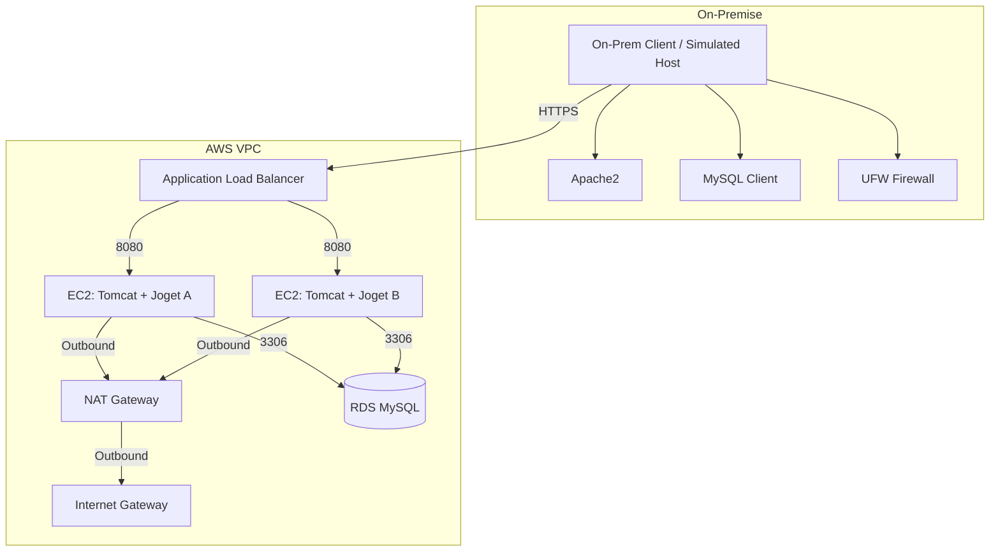

## Project Overview

This project provisions a hybrid-ready AWS environment for a Java web application using CloudFormation. It includes a secure VPC, public/private subnets, NAT, Application Load Balancer, two EC2 instances running Tomcat and Joget, and an RDS MySQL database. Security groups and IAM roles are configured for least-privilege access.

---

## Architecture Diagram



---

## Deployment & Teardown Instructions

### Deploy

1. Clone this repository and navigate to the project directory:
   ```sh
   git clone <repo-url>
   cd jobot-cloud-engineer
   ```

2. Deploy the CloudFormation stack:
   ```sh
   aws cloudformation create-stack \
     --stack-name jobot-demo \
     --template-body file://main.yaml \
     --parameters ParameterKey=KeyName,ParameterValue=<your-keypair> \
                  ParameterKey=DBPassword,ParameterValue=<your-db-password>
   ```

3. Wait for stack creation to complete.

4. Find the ALB DNS name in the CloudFormation Outputs to access Joget.

### Teardown

```sh
aws cloudformation delete-stack --stack-name jobot-demo
```

---

## On-Premise Simulation Details

The "on-premise" environment is simulated using the provided `onprem.sh` script.  
This script sets up a local Linux machine (or VM) with:
- Apache2 web server (simulating on-prem web services)
- MySQL client (for database connectivity testing)
- UFW firewall (restricting access to LAN/required ports)

**To run the simulation:**
```sh
bash onprem.sh
```
After running, you can access the local Apache test page and use the MySQL client to connect to the RDS endpoint (if allowed by security groups).

---

## Configuration Management Script Explanation

- **onprem.sh:** Automates the setup of a simulated on-premise environment with Apache2, MySQL client, and UFW firewall rules.
- **EC2 UserData (in CloudFormation):** Installs OpenJDK and Tomcat, deploys the Joget WAR file, and starts Tomcat on each EC2 instance.

---

## Hybrid Connectivity Plan

To establish secure private connectivity from on-premise to AWS:
1. Set up a Site-to-Site VPN or AWS Direct Connect between your on-premise network and AWS VPC.
2. Use AWS PrivateLink or VPC endpoints for private service access if needed.
3. Update route tables and security groups to allow traffic from on-premise IP ranges to AWS resources.
4. Restrict access using security groups and NACLs to only necessary ports and IPs.

---

## Security Group & Network ACL Configurations

### Security Groups

- **ALB Security Group:**  
  - Inbound: TCP 80 from 0.0.0.0/0 (internet)
- **App EC2 Security Group:**  
  - Inbound: TCP 8080 from ALB security group (for Tomcat/Joget)
- **RDS Security Group:**  
  - Inbound: TCP 3306 from App EC2 security group only

### Network ACLs

Default NACLs are used. For production, restrict inbound/outbound rules to only necessary ports and CIDRs.

---

## Outputs

- **ALB DNS Name:** Use this to access the Joget web application.
- **RDS Endpoint:** Use this for database connections (from EC2 only).

---